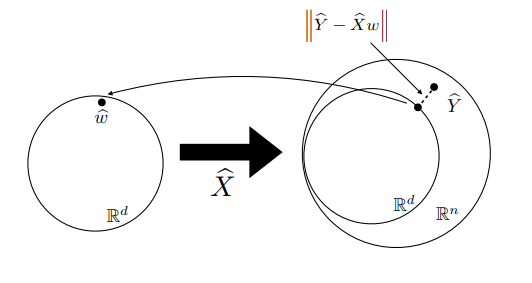
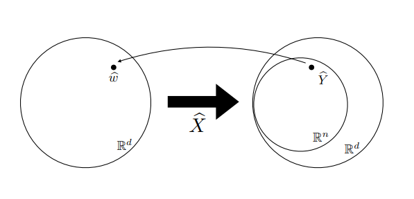

## Supervised Learning
* There need two ingredients
  1. two probability spaces X, Y and there measure P
    * $(X \times Y, P)$
  2. Loss function that take two elements of y to positive number
    * $Y \times Y \rightarrow [0, \infin)$
* Objective
  * $L(f)=\int_{X \times Y}l(y,f(x))dP(x,y)$
  * solve
    * $\min_{f:X\rightarrow Y}L(f)$
  * given only
    * $S_n=(x_1, y_1), \dots , (x_n, y_n) \text{\textasciitilde} P^n$

## Regularized Least Squares
### Learning problem and algorithms
Solve
$$
\min_{f\in F}L(f),\;\;\;\;L(f)=E_{(x,y)\text{\textasciitilde}~P}[l(y, f(x))]\\
F=\{f|f:X\rightarrow \R\}
$$
given only
$$
S_n=(x_1, y_1),\dots,(x_n, y_n)\text{\textasciitilde}P^n
$$
We want an learning algorithm which
$$
S_n \rightarrow \hat f=\hat f_{S_n}
$$
* $\hat f$ is a estimation of $f_P$ given the observed examples $S_n$
### Linear functions
* we can simplify problem to linear regression to get some intuitions
* Let $H$ be the space of linear functions
  $H=\{f:X\rightarrow \R |f(x)=w^Tx \}$
  * some properties can be defined
    * f and w is one to one
    * inner product $<f, \bar f>_H=w^T\bar w$
    * norm, metric $|| f - \bar f ||_H = || w - \bar w ||$
### OLS - Ordinary least squares
* ERM with least squares also called least squares (OLS)
* the problem is
$$
\min_{w\in\R^d}\frac{1}{n}\sum_{i=1}^n(y_i-w^Tx_i)^2
$$
* we often denote(표기) $\frac{1}{n}\sum_{i=1}^n(y_i-w^Tx_i)^2$ as $\hat L(w)$
* This is least square problems associasted to linear system
$$
\hat L(w) = \frac{1}{n}||\hat Y-\hat Xw||^2\\
\hat Xw=\hat Y\\
\hat X\in \R^{nd},\;\hat Y\in \R^{n}
$$
### Pseudoinverse
#### Overdetermined lin.system (n>d)
* left one is space of  parameter $w$, and right one is space of $\hat Y$
  * lets have assumption that $w$ has full rank $d$
* $\hat X$ maps left space to right space
* because the parameter's dimension is smaller than $\hat Y$, mapped space is smaller than $\hat Y$'s space

* as in the picture, there is no solution for problem. So, we minimize the distance of $\hat Y$ and $\hat Xw$
* we solve the optimal w value by optimality conditions
$$
\nabla_w\frac{1}{n}||\hat Y-\hat Xw||^2=0\\
\hat X^T\hat Xw=\hat X^T\hat Y\\
w=(\hat X^T\hat X)^{-1} \hat X^T\hat Y\\
$$
* let's define the pseudoinverse
$$
\hat X^\dagger = (\hat X^T\hat X)^{-1}\hat X^T
$$
* we need $O(d^3 + d^2n)$ in computation
  * $d^3$: invert of $\hat X\hat X^T$
  * $d^2n$: multiplying matrices

#### Underdetermined lin.system (d>n)
* left one is space of  parameter $w$, and right one is space of $\hat Y$ again

* because the parameter's dimension is bigger than $\hat Y$, mapped space is bigger than $\hat Y$'s space
* there could be many solutions on this problem like...
$$
\hat X\hat w=\hat Y,\;\hat Xw_0=0 \rightarrow \hat X(\hat w + w_0) = \hat Y
$$
* So, we consider problem in optimization
$$
\min_{w\in \R^d}||w||^2\;\;\;\text{, subjective to } \hat Xw=\hat Y
$$
* We can solve this problem using the method of Lagrange multipliers.
$$
L(w, \lambda)
=w^Tw+\lambda^T(\hat Xw-\hat Y)\\
\nabla_wL = 2w+\hat X^T\lambda = 0\\
\nabla_{\lambda}L = \hat Xw-\hat Y = 0\\
\therefore \hat w=\hat X^T(\hat X \hat X^T)^{-1}\hat Y
$$

* let's define the pseudoinverse
$$
\hat X^\dagger = \hat X^T(\hat X\hat X^T)^{-1}
$$
* we need $O(n^3 + n^2d)$ in computation
  * $n^3$: invert of $\hat X\hat X^T$
  * $n^2d$: multiplying matrices

### Is OLS robust?
#### in view of spectral, no
Consider the SVD of $\hat X$
$$
\hat X=USV^T
$$
$$
\hat w^\dagger=\hat X^\dagger\hat Y=\sum_{j=1}^r\frac{1}{s_j}(u_j^T\hat Y)v_j
$$
* if one of eigen values $s_j$ is small, estimated parameter changes a lot - not robust
* pseudoinverse introduces a bias towards certain solutions
#### solution - OLS to ridge regression
* we define $\hat X^\dagger$ in new way
$$
\hat X^\dagger=\lim_{\lambda \rightarrow 0_+}(\hat X^T\hat X + \lambda I)^{-1}\hat X^T=\lim_{\lambda \rightarrow 0_+}\hat X^T(\hat X^T\hat X + \lambda I)^{-1}
$$
for $\lambda > 0$, we can define new parameter $\hat w^\lambda$
$$
\hat w^\lambda=(\hat X^T\hat X + \lambda I)^{-1}\hat X^T\hat Y\\
= \sum_{j=1}^r\frac{s_j}{s_j^2+\lambda}(u_j^T\hat Y)v_j
$$
* for small s, $F(s) \approx 1/\lambda $
* for bigger s, $F(s) \approx 1/s $
* it makes model more robust

#### Ridge regression
$\hat w^\lambda=(\hat X^T\hat X + \lambda I)^{-1}\hat 
X^T\hat Y$ is the solution of 
$$
\min_{w\in \R^d}||\hat Y-\hat Xw||^2+\lambda||w||^2
$$
* hmmteresting...!!!

### Reference
1. https://www.youtube.com/watch?v=kNWONiLbfVs&list=PLyGKBDfnk-iB4Xz_EAJNEgGF5I-6OzRNI&index=2
    * Statistical Learning Theory and Applications - Class 2
2. https://www.youtube.com/watch?v=MiypgGqEPpQ&list=PLyGKBDfnk-iB4Xz_EAJNEgGF5I-6OzRNI&index=3
    * Statistical Learning Theory and Applications - Class 3
    * Regularized Least Squares
