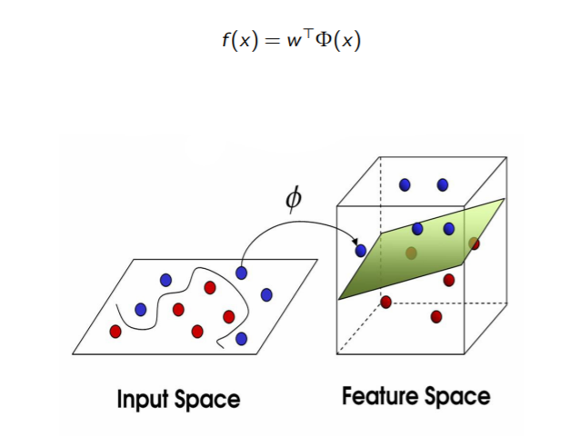

# Kernel
## Introduction
기존의 regression/classification을 위한 linear parametic model은
* learning phase에서 (x, y)으로 구성된 dataset은 parameter vector를 예측하거나, [posterior distribution](https://en.wikipedia.org/wiki/Posterior_probability)를 결정하는데 사용된다.
    * posterior distribution가 뭔지 몰라 찾아봄. Intuition만 뽑아내자면, 데이터 분포로부터 확률분포를 예측하는 것. 흔히 사용되는 MLE도 그 일종인듯 하다.
    > From the vantage point of Bayesian inference, MLE is a special case of maximum a posteriori estimation (MAP) that assumes a uniform prior distribution of the parameters. (Wikipedia)
* 이후 새로운 input x로부터 y를 예측할 때, 기존의 dataset은 버려진다(discard).
* 하지만, **prediction phase에서도 기존의 training data points를 사용하는** pattern recognition technique이 있다.
    * Parzen probability density model (이게 뭐지)
    * neareset neighbours
    * 암튼 얘네 둘다 memory based method의 일종이란다.
        * 이 단어는 어떤 맥락에서 언급된 것일까? 그 반대는?
        * 2021.12.04 수정
            * These methods store the entire training set in order to make predictions for future data points.
            * Neareset neighbours assign label of new vector same to closest example for training set. 
        * *그 반대는 model based라는데 추후에 다뤄보도록 하자*
* 이들은 공통적으로 vector간 similarity를 구할 수 있는 metric이 요구된다.
* 많은 linear parametric model들은 "dual representation"으로 표현될 수 있는데, 이 과정에서 kernel function이 필요하다.

$$
k(x, x') = \phi(x)^T\phi(x')
$$
k는 symmetric funciton, 즉 $k(x, x') = k(x', x)
$이다.
* kernel은 feature space $\phi(x)$에 대해서 inner product로 표현된다.
    * kernel substitution이라 알려져 있는 일종의 trick을 적용할 수 있다.
    * input vector x가 scalar 곱으로 들어가면, 그 scalar 곱을 kernel로 치환할 수 있다.
### kernel trick
[cs229 강의](https://youtu.be/8NYoQiRANpg?t=1762)
1. write algorithm in terms of $<x^{(i)}, x^{(j)}>$
2. let that some mapping from $x\rightarrow\phi(x)$
    * $\phi(x)$의 차원이 너무 크면 계산 비용이 너무 많이 들겠죠?
    * from later on, we extend to dimension of $\phi(x)$ inifinite (lol)
3. find way to compute $k(x, z) = \phi(x)^T\phi(z)$
    * $\phi(x)$와 $\phi(z)$의 차원이 졸라게 크더라도 그것의 내적을 계산할 수 있는 트릭을 구하는 과정
4. Replace $<x, z>$ with $k(x, z)$

## In view of least squares
### ERM
* minimum for least squares
$$
\theta = \min_{w\in \R^d}1/n||\hat Xw-\hat y||^2 \\
\hat w^\dagger=\argmin_{w \in \theta} ||w||
$$

The solution of ridge regression is

$$
\hat w^\lambda = (X_n^TX_n+n\lambda I)^{-1}X_n^T\hat Y
$$
* this requires $O(nd^2 + d^3)$

but also
$$
\hat w^\lambda = X_n^T(X_n^TX_n+n\lambda I)^{-1}\hat Y
$$
* this requires $O(dn^2 + n^3)$

### generalizing to non-linear functions
* we approximate f in two main possibilities
    $$
    f(x) = w^T\Phi(x)~~~~~~~f(x) = \Phi(w^Tx)
    $$
    * first one  $w^T\Phi(x)$
        * function is non-linear, but parametrization is linear - kernel method
        * what are we going to dive-into in this post 
    * second one
        * function is linear, but parametrization is non-linear - neural networks
#### feature maps
$$
f(x) = w^T\Phi(x)\\
\text{where } \Phi:X\rightarrow \R^p \text{ and }\phi:X\rightarrow\R \\
\Phi(x) = (\phi_1(x), \dots \phi_p(x))^T
$$
* $x$ is one row of X
* we can also understand it by visualizing geometric situation
    
#### Nonlinear function space
Let $H_\Phi$ be the space of nonlinear functions $f$
* $f \leftrightarrow w$ is one to one, if $\{\phi_1,\dots,\phi_p\}$ is linearly independent
    * proof can be done with [definition of linearly independent](https://en.wikipedia.org/wiki/Linear_independence)
* inner product $<f, \bar f>_{H_\Phi}:=w^T\bar w$
* norm/metric $||f - \bar f||_{H_\Phi}:=||w- \bar w||$
#### Back to ERM
$$
\min_{w\in \R^p}1/n\sum_{i=1}^n
(y_i-w^T\Phi(x_i))^2+\lambda||w||^2, \lambda \ge 0
$$
is equialent to ridge regreesion  
* considering $\Phi$ in X(n rows of x)
* Let $\hat\Phi \in \R^{np}$ with 
    $$
    (\hat\Phi)_{ij}=\phi_j(x_i)
    $$
* ridge regression solution is
    1. time $O(np^2 + p^3)$ memory $O(np + p^2)$
        $$
        \hat w^\lambda = (\hat\Phi^T\hat\Phi+n\lambda I)^{-1}\hat\Phi\hat Y
        $$
    2. time $O(pn^2 + n^3)$ memory $O(np + n^2)$
        $$
        \hat w^\lambda = \hat\Phi(\hat\Phi^T\hat\Phi+n\lambda I)^{-1}\hat Y
        $$
* substituting parmeter to features
$$
\hat w^\lambda = \hat\Phi = \sum_{i=1}^n\Phi(x_i)c_i \\
\hat f^\lambda(x)=\sum_{i=1}^n\Phi(x)^T\Phi(x_i)c_i
$$
### kernel
for $\hat\Phi, \Phi, \phi, $ we can consider following characteristics
$$
(\hat\Phi\hat\Phi^T)_{ij}=\Phi(x_i)^T\Phi(x_j)\\
\Phi(x_i)^T\Phi(x_j)=\sum_{s=1}^p\phi_s(x_i)\phi(x_j)
$$
* we can let p go to infinity
    * why?
        * fixing a p priori makes model finite
        * we don't know how big model will be
        * it would be nice if we are able to take p to inifity
    * It takes long time to compute "infinity sum"... can we compute the series in closed form?
        * In sum cases, we can
#### Kernel ridge regression
$$
\Phi(x_i)^T\Phi(x_j)=\lim_{p\rightarrow\infin}\sum_{s=1}^p\phi_s(x_i)\phi(x_j)=k(x_i, x_j)
$$
* function k is called kernel
then, we have kernel ridge regression
$$
\hat f^\lambda(x)=\sum_{i=1}^n\Phi(x)^T\Phi(x_i)c_i=\sum_{i=1}^nk(x, x_i)c_i\\
c=(\hat K+\lambda I)^{-1}\hat Y, \;\;(\hat K)_{ij}=\Phi(x_i)^T\Phi(x_j)=k(x_i, x_j)
$$
$\hat K$ is the kernel matrix, the Gram matrix of the data
#### legitimate kernel characteristics
1. symmetric
2. positive definite
    * eigen values of kernel is always either zero or positive (cannot be negative)
    $$
    a^T\hat Ka\ge 0, \forall a \in \R^n
    \\\iff \sum_{i, j=1}^nk(x_i, x_j)a_ia_j \ge 0
    $$
    * for any $a_1,\dots,a_n \in \R, x_1, \dots, x_n \in X$
    * $\sum_{i, j=1}^nk(x_i, x_j)a_ia_j = \sum_{i,j=1}^n\Phi(x_i)^T\Phi(x_j)a_ia_j=(\sum_{i=1}^n\Phi(x_i)a_i)^T(\sum_{i=1}^n\Phi(x_i)a_i)=||\sum_{i=1}^n\Phi(x_i)a_i||^2$
        * this makes k symmetric and positive definite
<!-- ## 6.1. Dual Representation
다시 PRML로 돌아와서, SVM를 dual representation으로 나타내다 보면 이 과정에서 kernel 함수가 자연스럽게 보이게 되는데, 이를 알아보자.

### Ex. regularized sum-of-squares error
* why does formulation mean in statistical view? [link](./regularized_least_squares.md) -->

### Reference
1. MLE - https://en.wikipedia.org/wiki/Maximum_likelihood_estimation
2. https://www.youtube.com/watch?v=_hOZw7SsTXc&list=PLyGKBDfnk-iB4Xz_EAJNEgGF5I-6OzRNI&index=4
    * MIT 9.520 2018 fall, lecture 4. kernel